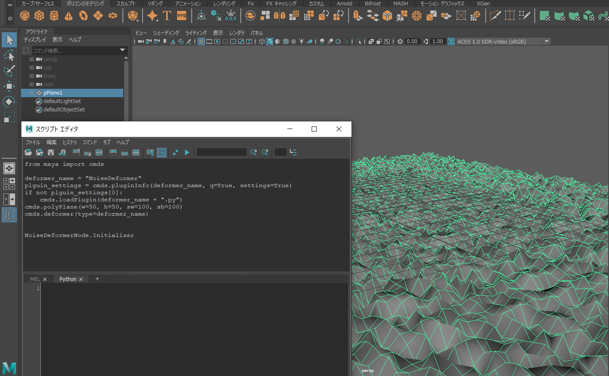
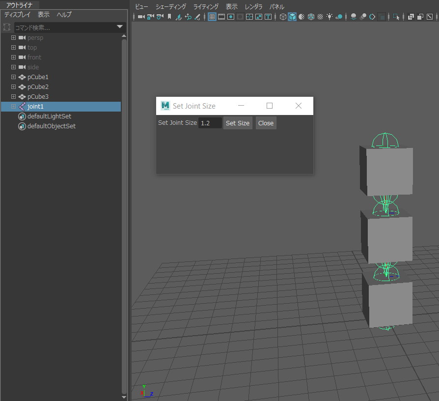

# MAYA_Module
MAYA Sample Sources
using IDE PyCharm 2020.3.5


## noise_deformer.py

```python

import maya.cmds as cmds
deformer_name = "NoiseDeformer"
plguin_settings = cmds.pluginInfo(deformer_name, q=True, settings=True)
if not plguin_settings[0]:
    cmds.loadPlugin(deformer_name + ".py")
cmds.polyPlane(w=50, h=50, sw=100, sh=100)
cmds.deformer(type=deformer_name)

```


## joint_size.py

```python

import joint_size as joint
joint.set_joint_size_GUI()


```
