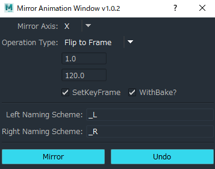
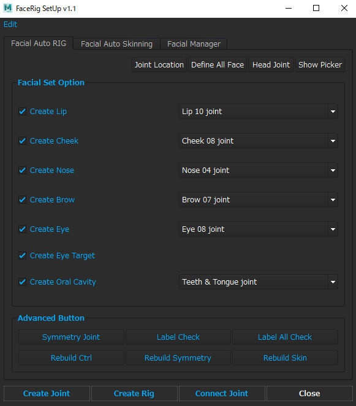
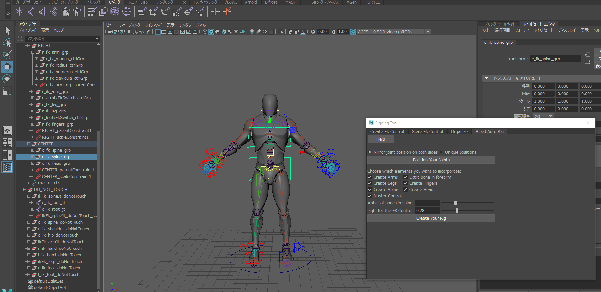

# MAYA_Module

### Animation Retarget Module
Maya_Modules/Animation/Animation_Retarget.py\
* in the same directory. drag&drop install.mel
* Select FBX joint and Controller ShapeCurve and run ConnectedNode.
* After adjustment is complete, run BakeAnimation.

### Animation Mirror Module
Maya_Modules/Animation/Mirror/Animation_Mirror.py\
* in the same directory. drag&drop install.mel
* If you do not want to do Animation Bake, uncheck the WithBake checkbox.
* Click the Mirror button to start Animation Mirror.



### Animation Exporter Batch
Maya_Modules/Misc/Batch_Exporter/Batch_Exporter.py

### FaceRig Setup Tool
Maya_Modules/Modules/FaceRigger/Facial_RIG.py\
* in the same directory. drag&drop install.mel
* Select headjoint and execute the headjoint button.
* Select the facial set option to generate a face joint.
* After moving the joint to the appropriate position, execute create rig.




### noise_deformer.py
Maya_Modules/Plugins/noise_deformer.py

```python

import maya.cmds as cmds
deformer_name = "NoiseDeformer"
plugin_settings = cmds.pluginInfo(deformer_name, q=True, settings=True)
if not plugin_settings[0]:
    cmds.loadPlugin(deformer_name + ".py")
cmds.polyPlane(w=50, h=50, sw=100, sh=100)
cmds.deformer(type=deformer_name)
```

### auto_rig.py
Maya_Modules/Modules/BodyRig/auto_rig.py

```python
import auto_rig
import importlib
importlib.reload(auto_rig)
auto_rig.create_main_window()
```

